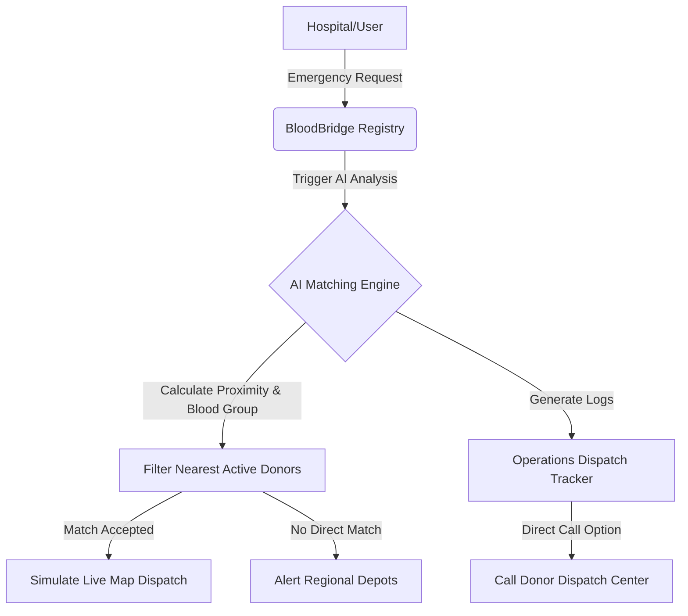

# 🩸 BloodBridge AI
> **Smart MERN-Stack Donor Match & Operations Dispatch Hub**

[](https://reactjs.org/)
[](https://vitejs.dev/)
[](https://nodejs.org/)
[](https://expressjs.com/)
[](https://www.mongodb.com/)
[](https://tailwindcss.com/)
[](https://jestjs.io/)

BloodBridge AI is a MERN-stack platform that coordinates critical blood donation dispatches. It connects hospitals and blood banks with active, eligible donors in real-time through an AI-powered smart matching engine, visual inventory radial gauges, and integrated communication features.

---

## 🗺️ System Workflow Architecture

Below is the workflow showing how emergency blood requests are analyzed, matched, and dispatched to donors:



---

## 🌟 Core Features

### 📋 Active Request Registry
* **Dynamic Grid Layout**: Portrait card registry sorted by urgency and time indicators (e.g., *Ranveer Singh*, *Alia Bhatt*).
* **SVG Droplets**: Color-coded custom blood droplet graphics indicating blood groups and status.
* **Direct Caller Hooks**: Native `tel:` device integration replacing simulations to enable immediate caller actions for matching donors.

### 📊 Blood Depots Inventory
* **Depletion Indicators**: A dynamic 4x2 visual progress grid mapping inventory availability against threshold margins.
* **Interactive Status Badges**: Detailed state pills such as `✓ Stable`, `⚠ Low Stock`, and `! Critical` with glowing visual pulses.
* **Smart Warning Banners**: Visual callout sections representing restock safety alerts with bells and forecasting line-chart illustrations.
* **AI Predictions Footer**: Continuous 24/7 logging banner integrated with forecasting analysis.

### ⚡ Emergency Request Panel
* **Redesigned Request Modal**: Aesthetic entry panel with blood drop logos and close buttons.
* **Custom Control Spinner**: Custom units increment/decrement counters.
* **Urgency Selection**: Color-coded urgency selection pills reflecting the severity of matching alerts.

### 🗺️ Emergency Maps & Nearby Assets
* **Geographical Search**: Real-time geographical queries matching nearest donors and hospitals on a live matching canvas.
* **AI Voice Dispatch Assistant**: Interactive voice supervisor simulations built on English & Hindi speech engines supporting operations management.

---

## 📂 Repository File Tree

```bash
BloodBridge-AI/
├── backend/
│   ├── config/             # DB configurations & environment setup
│   ├── controllers/        # Request handling logical controllers
│   ├── middleware/         # Auth verify & input validation filters
│   ├── models/             # Mongoose schemas (User, Request, Notification, Inventory)
│   ├── routes/             # REST API endpoint definitions
│   └── tests/              # Jest integration suites
└── frontend/
    ├── public/             # Static public assets
    └── src/
        ├── components/     # Reusable dashboard widgets, modals, and loaders
        ├── context/        # Auth & Location global state stores
        ├── pages/          # Dashboard panels, Admin panel, Map & Billing panels
        └── services/       # Axios API service integrations
```

---

## 🔗 REST API Endpoint Reference

| Category | HTTP Method | Endpoint Path | Description |
| :--- | :--- | :--- | :--- |
| **Authentication** | `POST` | `/api/auth/register` | Register new hospital / administrator |
| | `POST` | `/api/auth/login` | Login session authentication |
| | `GET` | `/api/auth/me` | Fetch active user credentials |
| **Hospitals** | `GET` | `/api/hospital/me` | Retrieve current hospital profile |
| | `PUT` | `/api/hospital/:id` | Update profile information |
| **Requests** | `POST` | `/api/request` | Dispatch new emergency blood request |
| | `GET` | `/api/request/:id` | Fetch request matching tracking details |
| **Inventory** | `POST` | `/api/inventory` | Upsert blood depot units count |
| **Notifications** | `DELETE`| `/api/notifications/:id` | Dismiss live panel notification |

---

## ⚙️ Getting Started & Installation

### 1. Prerequisites
Ensure you have the following installed on your machine:
* [Node.js](https://nodejs.org/) (v16+)
* [MongoDB](https://www.mongodb.com/) (running locally or via Atlas)

### 2. Backend Installation
1. Navigate to the backend directory:
   ```bash
   cd backend
   ```
2. Install dependencies:
   ```bash
   npm install
   ```
3. Create a `.env` file in the root of the `backend` folder:
   ```env
   PORT=5000
   MONGO_URI=mongodb://localhost:27017/bloodbridge
   JWT_SECRET=your_super_secret_jwt_key
   NODE_ENV=development
   ```
4. Start the API server:
   ```bash
   npm start
   ```

### 3. Frontend Installation
1. Navigate to the frontend directory:
   ```bash
   cd ../frontend
   ```
2. Install dependencies:
   ```bash
   npm install
   ```
3. Create a `.env` file in the root of the `frontend` folder:
   ```env
   VITE_API_URL=http://localhost:5000/api
   ```
4. Run the Vite developer server:
   ```bash
   npm run dev
   ```
5. Open your browser and navigate to `http://localhost:5173`.

---

## 🧪 Verification & Test Suites

To execute the automated API validation suites, run the following commands inside the `backend` directory:
```bash
cd backend
npm test
```

The test runner compiles Jest assertions targeting:
* **Hospital Registry**: Updates validation schemas and prevents illegal role overrides.
* **Security Controls**: Restricts admin privileges and monitors password lengths.
* **Inventory Constraints**: Restricts negative unit submissions.
* **Notification Lifecycles**: Dismisses and reads entries dynamically.

---

## 🎨 Design System Guidelines
* **Typography**: Modern typography built on *Outfit* (headers) & *Inter* (body text).
* **Accents Palette**: Curated dark mode colors, gradient crimson accents (`#E11D48`), emerald green metrics, and soft amber status warnings.
* **Micro-interactions**: Framer Motion transitions, spring scales on button presses, and warning ripples on critical stock levels.
